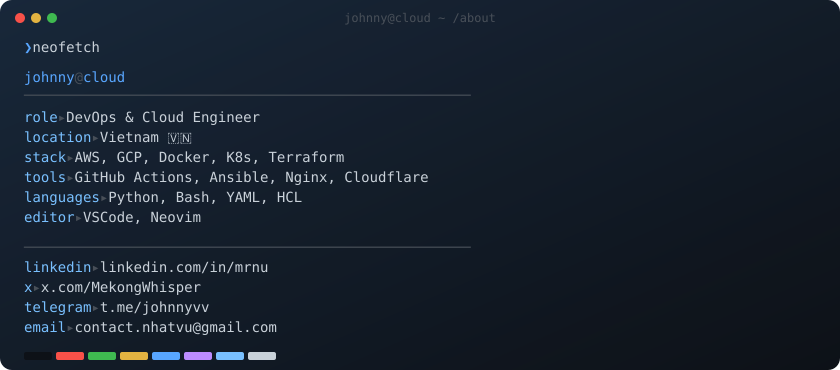

<div align="center">

<br/>

```
     ██╗ ██████╗ ██╗  ██╗███╗   ██╗███╗   ██╗██╗   ██╗
     ██║██╔═══██╗██║  ██║████╗  ██║████╗  ██║╚██╗ ██╔╝
     ██║██║   ██║███████║██╔██╗ ██║██╔██╗ ██║ ╚████╔╝ 
██   ██║██║   ██║██╔══██║██║╚██╗██║██║╚██╗██║  ╚██╔╝  
╚█████╔╝╚██████╔╝██║  ██║██║ ╚████║██║ ╚████║   ██║   
 ╚════╝  ╚═════╝ ╚═╝  ╚═╝╚═╝  ╚═══╝╚═╝  ╚═══╝   ╚═╝   
```

<sub>**DevOps · Cloud Engineer · Vietnam 🇻🇳**</sub>

<br/>

<a href="https://www.linkedin.com/in/mrnu/"></a>&nbsp;&nbsp;
<a href="https://x.com/MekongWhisper"></a>&nbsp;&nbsp;
<a href="https://t.me/johnnyvv"></a>&nbsp;&nbsp;
<a href="mailto:contact.nhatvu@gmail.com"></a>

<br/><br/>

</div>

<!-- ─────────────────────────────────────────────── -->

<picture>
  <source media="(prefers-color-scheme: dark)" srcset="dark_mode.svg" />
  <source media="(prefers-color-scheme: light)" srcset="light_mode.svg" />
  
</picture>

<br/>

<!-- ─────────────────────────────────────────────── -->

<div align="center">

### `stack`


<br/><br/>

### `metrics`


<a href="https://github.com/johnny-official">
  
</a>

<br/>

<a href="https://github.com/johnny-official">
  
</a>

<br/><br/>


<br/>

---

<sub>
<code>~ $ echo "Building reliable infrastructure, one pipeline at a time." </code>
</sub>

<br/>


</div>
